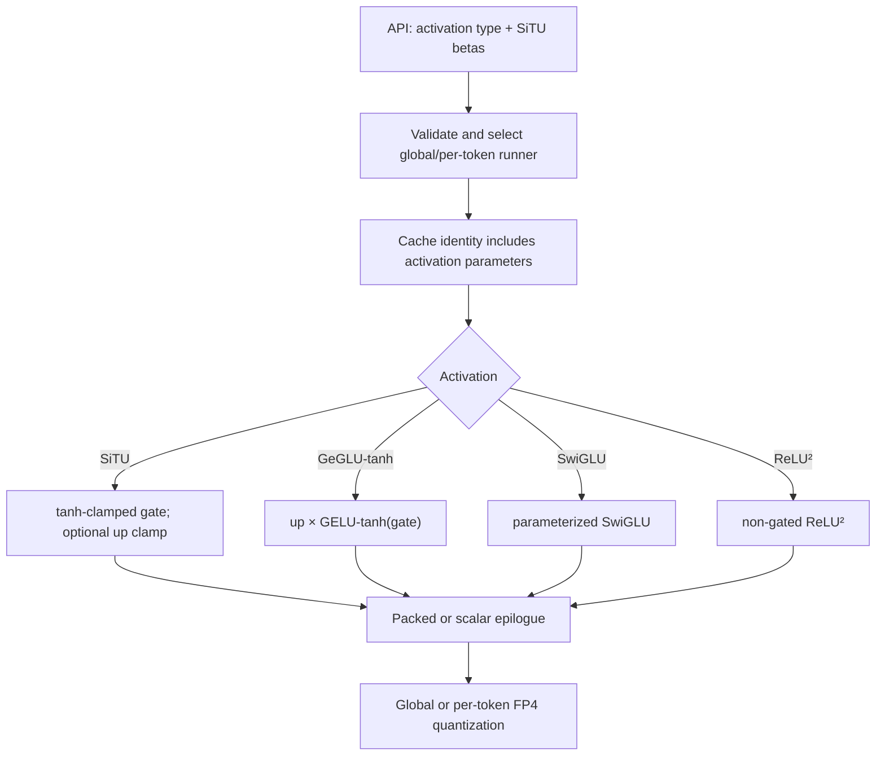

# GitHub Stars 合并报告 - 2026-08-06

**合并日期**: 2026-08-07
**监控日期**: 2026-08-06
**仓库数量**: 12

## 目录

1. [ByteDance-Seed/VeOmni](#ByteDance-Seed-VeOmni)
2. [ModelTC/LightX2V](#ModelTC-LightX2V)
3. [aigc-apps/VideoX-Fun](#aigc-apps-VideoX-Fun)
4. [flashinfer-ai/flashinfer](#flashinfer-ai-flashinfer)
5. [hao-ai-lab/FastVideo](#hao-ai-lab-FastVideo)
6. [huggingface/diffusers](#huggingface-diffusers)
7. [modelscope/DiffSynth-Engine](#modelscope-DiffSynth-Engine)
8. [modelscope/DiffSynth-Studio](#modelscope-DiffSynth-Studio)
9. [sgl-project/sglang](#sgl-project-sglang)
10. [vipshop/cache-dit](#vipshop-cache-dit)
11. [vllm-project/vllm](#vllm-project-vllm)
12. [vllm-project/vllm-omni](#vllm-project-vllm-omni)

---

<a id="ByteDance-Seed-VeOmni"></a>


**报告日期**: 2026-08-07
**监控日期**: 2026-08-06
**仓库地址**: [ByteDance-Seed/VeOmni](https://github.com/ByteDance-Seed/VeOmni)

## 仓库信息

- **描述**: VeOmni: Scaling Any Modality Model Training with Model-Centric Distributed Recipe Zoo
- **语言**: Python
- **星标数**: 2130
- **最后更新**: 2026-08-06T16:17:12Z

## 提交统计

- **昨日提交总数**: 2
- **提交者数量**: 2
- **主要提交者**: Albert Zhang, Crystal-jiang

## AI分析总结

### 主要更新类型
本次提交均为**文档更新**，无代码功能变更或Bug修复。

### 关键变更点及与项目方向的关系
1. **SeedOss训练示例指南**：新增了使用SeedOss（字节内部对象存储）进行训练的完整示例文档。这直接服务于VeOmni“模型中心化分布式训练配方库”的核心定位，降低了用户接入自有数据存储的门槛。
2. **NPU训练支持文档**：为Qwen3.5、Qwen3-Omni和LTX-2.3三个模型补充了NPU（神经网络处理器）训练说明。这与项目“任意模态模型训练”的目标一致，表明VeOmni正积极扩展对国产AI芯片（如昇腾）的适配，而非仅依赖GPU。

### 对项目的影响和潜在意义
- **降低使用门槛**：SeedOss示例让用户能快速上手，减少环境配置时间，有利于吸引更多开发者试用。
- **生态扩展**：NPU文档的补充，意味着VeOmni在硬件层面更加中立，可服务于国内算力受限场景，增强项目在国产化替代趋势中的竞争力。
- **模型覆盖完善**：为Qwen3系列和LTX-2.3（视频生成模型）提供NPU指南，说明项目正同步跟进主流开源模型的训练适配，保持配方库的时效性。

### 值得关注的技术点
- **NPU适配细节**：文档中可能涉及算子映射、内存布局优化或混合精度策略，这些是NPU训练的关键难点，值得后续查看具体内容。
- **SeedOss与现有数据管线的集成方式**：是否通过统一接口抽象存储后端，这关系到项目架构的可扩展性。

### 对项目发展的影响
结合README中“分布式配方库”的定位，这两次文档更新是典型的**生态建设动作**。它们不改变核心算法，但通过完善使用指南和硬件适配，扩大了VeOmni的适用场景。短期看，能提升社区活跃度；长期看，NPU支持是重要战略布局，可能吸引国内云厂商或企业用户采用，推动项目从研究工具向生产级平台演进。整体上，这些提交体现了项目在“广度”（更多模型、更多硬件）上的持续投入，为后续功能迭代奠定了用户基础。

## 详细提交记录

### [68c04fe](https://github.com/ByteDance-Seed/VeOmni/commit/68c04fe1dd20c52677085c414dbb206590977c0a)

- **作者**: Crystal-jiang
- **时间**: 2026-08-06T12:33:47Z
- **提交信息**: [docs] feat: add SeedOss training example guide (#1023)

### [84bc360](https://github.com/ByteDance-Seed/VeOmni/commit/84bc3601b674c460ec01ef387b147d0fa3bce6f6)

- **作者**: Albert Zhang
- **时间**: 2026-08-06T11:55:46Z
- **提交信息**: [docs] feat: document NPU training for Qwen3.5, Qwen3-Omni and LTX-2.3 (#1020)

---

<a id="ModelTC-LightX2V"></a>


**报告日期**: 2026-08-07
**监控日期**: 2026-08-06
**仓库地址**: [ModelTC/LightX2V](https://github.com/ModelTC/LightX2V)

## 仓库信息

- **描述**: Lightweight Image Video Action Generation Inference Framework
- **语言**: Python
- **星标数**: 2577
- **最后更新**: 2026-08-06T19:13:25Z

## 提交统计

- **昨日提交总数**: 1
- **提交者数量**: 1
- **主要提交者**: Bilang ZHANG

## AI分析总结

### 主要更新类型
- **性能优化**：本次提交属于模型推理精度与性能的调优，而非功能新增或Bug修复。

### 关键变更点
- 将`minimax_h3`模型中`SENSITIVE_LAYER_DTYPE`的数据类型从FP32调整为BF16。
- 该变更针对特定层（敏感层）的精度设置，属于细粒度的精度控制调整。

### 与项目方向的关系
- LightX2V定位为**轻量级视频生成推理框架**，核心目标是降低推理资源消耗、提升吞吐量。
- 将敏感层从FP32降为BF16，直接减少了显存占用和计算开销，符合“轻量”和“高效”的项目核心诉求。
- 该调整表明项目在**精度与性能的权衡**上持续优化，尤其针对大规模视频生成模型（如minimax_h3）的部署成本。

### 对项目的影响与潜在意义
- **显存节省**：BF16相比FP32减半显存占用，有助于在相同硬件上支持更大batch size或更长视频序列。
- **推理加速**：BF16在支持混合精度加速的硬件（如A100/H100）上可提升计算吞吐。
- **风险控制**：仅对“敏感层”调整精度，说明开发者已识别出对精度不敏感的层，避免全局降精度带来的质量损失，体现了**精细化调优**策略。
- **潜在意义**：该改动可能为后续更多模型（如其他视频生成架构）的精度-性能平衡提供参考范式。

### 值得关注的技术点
- **SENSITIVE_LAYER_DTYPE机制**：项目可能已建立一套自动识别“敏感层”的机制，或通过配置手动指定。该机制是平衡精度与性能的关键设计。
- **BF16的适用性**：BF16在数值范围上与FP32接近，但尾数精度较低，适合对精度不敏感的中间层。此改动验证了该假设在视频生成模型中的有效性。

### 对项目发展的影响
- **推动轻量化落地**：视频生成模型通常参数量大、推理成本高，此类精度优化是降低实际部署门槛的重要步骤。
- **增强竞争力**：在同类推理框架中，更低的显存和更高的吞吐是吸引用户的关键指标。
- **为后续优化铺路**：该提交可能开启一系列针对不同模型的精度调优工作，形成系统化的“精度-性能”优化流程，进一步巩固LightX2V在轻量级视频推理领域的定位。

**总结**：本次提交是一次精准的性能优化，通过将敏感层精度从FP32降至BF16，在几乎不影响输出质量的前提下，显著降低资源消耗，直接服务于项目“轻量高效”的核心目标，并为未来更广泛的模型优化提供了方法论基础。

## 详细提交记录

### [bb52e30](https://github.com/ModelTC/LightX2V/commit/bb52e306a67b8ac4cbe48abbe0f88d362bfc9bc3)

- **作者**: Bilang ZHANG
- **时间**: 2026-08-06T12:28:10Z
- **提交信息**: updata: minimax_h3 SENSITIVE_LAYER_DTYPE FP32 -> BF16 (#1335)

---

<a id="aigc-apps-VideoX-Fun"></a>


**报告日期**: 2026-08-07
**监控日期**: 2026-08-06
**仓库地址**: [aigc-apps/VideoX-Fun](https://github.com/aigc-apps/VideoX-Fun)

## 仓库信息

- **描述**: 📹 A more flexible framework that can generate videos at any resolution and creates videos from images. 
- **语言**: Python
- **星标数**: 2188
- **最后更新**: 2026-08-06T10:24:10Z

## 提交统计

- **昨日提交总数**: 0

## AI分析总结

昨日无提交

---

<a id="flashinfer-ai-flashinfer"></a>


**报告日期**: 2026-08-07
**监控日期**: 2026-08-06
**仓库地址**: [flashinfer-ai/flashinfer](https://github.com/flashinfer-ai/flashinfer)

## 仓库信息

- **描述**: FlashInfer: Kernel Library for LLM Serving
- **语言**: Python
- **星标数**: 6116
- **最后更新**: 2026-08-07T01:03:29Z

## 提交统计

- **昨日提交总数**: 4
- **提交者数量**: 4
- **主要提交者**: Chengke, Matt Murphy, Saddss

## AI分析总结

# FlashInfer 提交分析（第1/1批，共4条提交）

## 主要更新类型

本批提交涵盖**版本发布**、**功能新增**、**性能优化**和**Bug修复**四类变更，其中性能优化和Bug修复各占一条，功能新增和版本发布各占一条。

## 关键变更点

1. **版本发布至0.6.18**：基于`v0.6.17rc3`的48个提交，API变更包括`trtllm_bf16_routed_moe`等函数支持`topk_ids`的元组输入，以及新增`gemm1_lora_delta`参数。

2. **新增GeGLU-tanh和SiTU激活函数**：在Blackwell CuTe-DSL NVFP4融合MoE路径中新增两种门控激活变体，SiTU作为参数化的SwiGLU变体实现，避免改动与TensorRT-LLM同步的枚举类型。

3. **优化自动调优器缓存键**：修复`_find_nearest_profile`的LRU缓存因哈希相等但对象不等导致的缓存抖动问题，通过规范化键仅保留选择所需字段，性能提升约55-88倍。

4. **修复SM12x平台cuDNN FP8路径**：在`override_shape`不可用时将cuDNN从自动选择中排除，解决无界主机端编译和异步CUDA崩溃两个问题。

## 对项目的影响

- **版本发布**标志着0.6.18功能集冻结，为后续稳定版发布铺路。
- **激活函数扩展**增强了MoE内核的灵活性，满足更多模型架构需求，同时保持与TensorRT-LLM的兼容性。
- **缓存优化**直接降低MLA场景下的GIL开销和TTFT约4%，对长序列推理场景有显著收益。
- **Bug修复**消除了RTX 5090等SM12x设备上的崩溃风险，扩大了硬件支持范围。

## 值得关注的技术点

- SiTU作为参数化变体而非独立枚举的设计，体现了对上游同步约束的巧妙处理。
- 缓存键规范化方案精准识别了哈希与相等性不一致的根因，是典型的Python性能陷阱修复。
- cuDNN门控方案同时解决性能和稳定性问题，证据链完整，展示了严谨的工程方法。

## 对项目发展的影响

这些提交体现了FlashInfer在**推理内核深度优化**和**硬件适配广度**上的持续投入。新增激活函数扩展了模型支持面，缓存优化提升了实际部署性能，SM12x修复则巩固了新一代GPU的兼容性。版本发布节奏稳定，API演进谨慎（如元组输入支持），表明项目在快速迭代的同时注重向后兼容和生态协同，整体朝着更成熟、更广泛适配的推理加速库方向稳步前进。

## 详细提交记录

### [89a2592](https://github.com/flashinfer-ai/flashinfer/commit/89a259218ac11826df165a829edfdf7917cb48df)

- **作者**: Alex Yang
- **时间**: 2026-08-06T21:10:01Z
- **提交信息**: bump version to 0.6.18 (#4384)

## Description

Bump version to 0.6.18 for release.

**Cut point:** `main` at `e44dae5b` (48 commits since `v0.6.17rc3`).

> [!NOTE]
> `v0.6.17` is not tagged yet — the release is in progress, currently at
`v0.6.17rc3`.
> The API diff below is therefore taken against `v0.6.17rc3` (the
current contents of
> `release-v0.6.17`) rather than the last stable tag, so it shows only
the surface that
> is new in 0.6.18. The `v0.6.16` → `0.6.17` surface was already
reviewed in #4283.

## Related Issues (Gated-by PRs)


https://github.com/flashinfer-ai/flashinfer/issues?q=is%3Aopen+label%3Av0.6.18

## Reviewer Notes

**API changes review**

API changes since v0.6.17rc3, using `scripts/list_apis.sh`

```diff
diff -u \
  <(scripts/list_apis.sh -d -p --ref v0.6.17rc3) \
  <(scripts/list_apis.sh -d -p)
--- /dev/fd/11	2026-08-06 14:02:34
+++ /dev/fd/12	2026-08-06 14:02:35
@@ -1200,9 +1200,13 @@
 ) -> Union[List[torch.Tensor], torch.Tensor]:
 
 
+    topk_ids: Union[torch.Tensor, Tuple[torch.Tensor, torch.Tensor]],
+) -> Tuple[torch.Tensor, Optional[torch.Tensor], "RoutingInputMode"]:
+
+
 @flashinfer_api(trace=trtllm_bf16_routed_moe_trace)
 def trtllm_bf16_routed_moe(
-    topk_ids: torch.Tensor,
+    topk_ids: Union[torch.Tensor, Tuple[torch.Tensor, torch.Tensor]],
     hidden_states: torch.Tensor,
     gemm1_weights: torch.Tensor,
     gemm2_weights: torch.Tensor,
@@ -1327,7 +1331,7 @@
 
 @flashinfer_api(trace=trtllm_fp8_block_scale_routed_moe_trace)
 def trtllm_fp8_block_scale_routed_moe(
-    topk_ids: torch.Tensor,
+    topk_ids: Union[torch.Tensor, Tuple[torch.Tensor, torch.Tensor]],
     routing_bias: Optional[torch.Tensor],
     hidden_states: torch.Tensor,
     hidden_states_scale: torch.Tensor,
@@ -1431,6 +1435,7 @@
     per_token_scale: Optional[torch.Tensor] = None,
     output: Optional[torch.Tensor] = None,
     tune_max_num_tokens: int = 8192,
+    gemm1_lora_delta: Optional[torch.Tensor] = None,
 ) -> List[torch.Tensor]:
 
 
@@ -1578,6 +1583,8 @@
         swiglu_alpha: float = DEFAULT_SWIGLU_ALPHA,
         swiglu_beta: float = DEFAULT_SWIGLU_BETA,
         swiglu_limit: float = DEFAULT_SWIGLU_LIMIT,
+        situ_beta: Optional[float] = None,
+        situ_linear_beta: Optional[float] = None,
         use_fused_finalize: bool = True,
     ):
 
@@ -1627,6 +1634,8 @@
     swiglu_alpha: float = DEFAULT_SWIGLU_ALPHA,
     swiglu_beta: float = DEFAULT_SWIGLU_BETA,
     swiglu_limit: float = DEFAULT_SWIGLU_LIMIT,
+    situ_beta: Optional[float] = None,
+    situ_linear_beta: Optional[float] = None,
     *,
     per_token_scale: Optional[torch.Tensor] = None,
 ) -> torch.Tensor:
@@ -1844,6 +1853,10 @@
 ) -> Tuple[torch.Tensor, None]:
 
 
+    weights: torch.Tensor, sf_vec_size: int = 32
+) -> Tuple[torch.Tensor, torch.Tensor]:
+
+
     w1_bf16: torch.Tensor,
     w2_bf16: torch.Tensor,
     *,
@@ -1855,6 +1868,17 @@
 ) -> Dict[str, torch.Tensor]:
 
 
+    w1_bf16: torch.Tensor,
+    w2_bf16: torch.Tensor,
+    *,
+    num_local_experts: int,
+    hidden_size: int,
+    intermediate_size: int,
+    device: Optional[torch.device] = None,
+    permute_cache: Optional[dict] = None,
+) -> Dict[str, torch.Tensor]:
+
+
     x: torch.Tensor, group_size: int = 64, dim: int = -1
 ) -> torch.Tensor:
 
@@ -1980,7 +2004,14 @@
     out: Optional[torch.Tensor] = None,
     out_dtype: torch.dtype = torch.bfloat16,
     backend: Literal[
-        "cudnn", "cutlass", "tgv", "cublaslt", "tinygemm", "cutile", "auto"
+        "cudnn",
+        "cutlass",
+        "tgv",
+        "cublaslt",
+        "tinygemm",
+        "cutile",
+        "cute-dsl",
+        "auto",
     ] = "cudnn",
 ) -> torch.Tensor:
     A: torch.Tensor,
@@ -2658,16 +2689,63 @@
     initial_state_source: Optional[torch.Tensor] = None,
     initial_state_indices: Optional[torch.Tensor] = None,
     beta_is_logit: bool = False,
+    seq_order: Optional[torch.Tensor] = None,
+    prefill_workspace: Optional[_kda_prefill.RecurrentKDAPrefillWorkspace] = None,
 ) -> tuple[torch.Tensor, Optional[torch.Tensor]]:
 [Global Functions]
+@flashinfer_api(trace=recurrent_kda_trace)
+def recurrent_kda(
+    q: torch.Tensor,
+    k: torch.Tensor,
+    v: torch.Tensor,
+    g: torch.Tensor,
+    beta: torch.Tensor,
+    A_log: Optional[torch.Tensor] = None,
+    dt_bias: Optional[torch.Tensor] = None,
+    scale: Optional[float] = None,
+    initial_state: Optional[torch.Tensor] = None,
+    output_final_state: bool = False,
+    use_qk_l2norm_in_kernel: bool = True,
+    use_gate_in_kernel: bool = False,
+    lower_bound: Optional[float] = None,
+    cu_seqlens: Optional[torch.Tensor] = None,
+    ssm_state_indices: Optional[torch.Tensor] = None,
+    num_spec_tokens: Optional[int] = None,
+    num_accepted_tokens: Optional[torch.Tensor] = None,
+    output: Optional[torch.Tensor] = None,
+    initial_state_source: Optional[torch.Tensor] = None,
+    initial_state_indices: Optional[torch.Tensor] = None,
+    beta_is_logit: bool = False,
+    *,
+    backend: Literal["cute-dsl", "cake"] = "cute-dsl",
+) -> tuple[torch.Tensor, Optional[torch.Tensor]]:
+
+
+@flashinfer_api(trace=fused_kda_decode_trace)
+def fused_kda_decode(
+    x: torch.Tensor,
+    weight: torch.Tensor,
+    conv_state: torch.Tensor,
+    raw_gate: torch.Tensor,
+    raw_beta: torch.Tensor,
+    A_log: torch.Tensor,
+    dt_bias: torch.Tensor,
+    state_indices: torch.Tensor,
+    state: torch.Tensor,
+    output_gate: torch.Tensor,
+    norm_weight: torch.Tensor,
+    lower_bound: Optional[float] = -5.0,
+    norm_eps: float = 1e-5,
+    output: Optional[torch.Tensor] = None,
+) -> torch.Tensor:
+[Global Functions]
 @flashinfer_api
 def checkpointing_ssu(
     state: torch.Tensor,
-    old_x: torch.Tensor,
-    old_B: torch.Tensor,
-    old_dt: torch.Tensor,
-    old_cumAdt: torch.Tensor,
-    cache_buf_idx: torch.Tensor,
+    x_cache: torch.Tensor,
+    B_cache: torch.Tensor,
+    dt_cache: torch.Tensor,
+    ring_start: torch.Tensor,
     prev_num_accepted_tokens: torch.Tensor,
     x: torch.Tensor,
     dt: torch.Tensor,
@@ -2688,6 +2766,11 @@
     cu_seqlens: Optional[torch.Tensor] = None,
     max_seqlen: Optional[int] = None,
     enable_pdl: bool = False,
+    cb_scaled: Optional[torch.Tensor] = None,
+    cumAdt_vec: Optional[torch.Tensor] = None,
+    cb_old: Optional[torch.Tensor] = None,
+    precompute_heads_per_cta: int = 0,
+    algorithm: str = "auto",
 ) -> torch.Tensor:
 [Global Functions]
 @flashinfer_api(trace=selective_state_update_trace)
```


<!-- This is an auto-generated comment: release notes by coderabbit.ai
-->

## Summary by CodeRabbit

* **Chores**
  * Updated the application version to 0.6.18.

<!-- end of auto-generated comment: release notes by coderabbit.ai -->

Co-authored-by: Claude Opus 5 <noreply@anthropic.com>

### [e44dae5](https://github.com/flashinfer-ai/flashinfer/commit/e44dae5b36ab5a8fc0c8834d4614906879c80659)

- **作者**: Matt Murphy
- **时间**: 2026-08-06T20:35:50Z
- **提交信息**: feat(moe): add CuTe-DSL GeGLU-tanh and SiTU activations (#4009)

## 📌 Description

Add two gated activation variants to the Blackwell CuTe-DSL NVFP4 fused
MoE path:

- `ActivationType.GegluTanh` computes `up * GELU(gate,
approximate=\"tanh\")`.
- Supplying `situ_beta` with `ActivationType.Swiglu` selects SiTU: `up *
beta * tanh(gate / beta) * sigmoid(gate)`. An optional
`situ_linear_beta` applies the smooth tanh clamp to the up branch as
well.
- Propagate activation configuration through functional, wrapper,
global-scale, per-token, autotuner, compiled-kernel-cache, and trace
paths.
- Validate incompatible/non-finite SiTU configurations and add PyTorch
numerical references with negative controls against SwiGLU.

SiTU intentionally remains a parameterized `ActivationType.Swiglu`
variant rather than adding a value to the TensorRT-LLM-synchronized
`ActivationType` enum.

### Architecture / Code Overview



## 🔍 Related Issues

None.

## 🚀 Pull Request Checklist

### ✅ Pre-commit Checks

- [x] I have installed `pre-commit`.
- [x] I have installed the hooks with `pre-commit install`.
- [x] I ran all hooks on every changed file; all hooks pass.

## 🧪 Tests

- [x] Tests have been added or updated as needed.
- [x] Targeted CPU and GPU tests pass, with the exception noted below
for the strengthened non-unit-beta rerun.

Commands/results:

- `pre-commit run --files <all 9 changed files>` — passed.
- Activation validation/cache tests plus trace consistency — 442 passed.
- B300 GeGLU global/per-token numerical tests — 2 passed.
- B300 SiTU global/per-token numerical tests — 4 passed with the initial
beta matrix.
- B300 SiTU wrapper/autotune test — 1 passed.

The SiTU cases were subsequently strengthened to use non-unit gate betas
so missing beta factors cannot pass accidentally. The shared B300s
became occupied before that exact parametrization could be rerun
locally; CI or the manual repro below should cover it.

## Reviewer Ask

- **Manual repro:** run `CUDA_VISIBLE_DEVICES=0 PYTHONPATH=$PWD python
-m pytest
'tests/moe/test_cute_dsl_fused_moe.py::TestCuteDslFusedMoeFunctional::test_situ_accuracy'
-q`; expect all four non-unit-beta global/per-token cases to pass.
- **Review focus:** the SiTU API representation (`ActivationType.Swiglu`
+ `situ_beta`), the packed/scalar epilogue formulas, and activation/beta
cache-key isolation.
- **Not requested:** re-evaluation of pre-existing trace-layout
limitations or broader MoE dispatch design.

## Perf Evidence

This draft touches a performance-sensitive fused MoE kernel but does not
claim a speedup.

- **Trace picture:** not attached; this PR makes no performance claim.
- **CPU overhead:** activation parameters are normalized and validated
when constructing runners; no additional per-element or synchronization
work is added on the Python request path.
- **GPU fence/stall sanity:** activation remains fused in the existing
GEMM1 epilogue. No extra kernel launch, host/device transfer, fence, or
synchronization point is introduced.
- **Serving/sharding evidence:** not applicable; this is neither a
scheduler nor sharding refactor.

## Reviewer Notes

The scalar and packed activation branches are intentionally kept
explicit to match the existing epilogue structure and make formula
equivalence reviewable. The branch is based directly on current
`flashinfer-ai/flashinfer:main`.

Made with [Cursor](https://cursor.com)

<!-- This is an auto-generated comment: release notes by coderabbit.ai
-->
## Summary by CodeRabbit

* **New Features**
* Added SiTU-gated activation support in fused MoE NVFP4, including
optional linear tanh clamping parameters.
  * Added GeGLU with tanh approximation as a supported activation.
* Exposed SiTU configuration end-to-end across fused MoE APIs, wrappers,
autotuning, and tracing.
* **Bug Fixes**
* Improved activation selection and configuration validation consistency
across execution paths.
* **Tests**
* Added accuracy, validation, and autotuning coverage for SiTU and
GeGLU-Tanh activations.
<!-- end of auto-generated comment: release notes by coderabbit.ai -->

Co-authored-by: Cursor <cursoragent@cursor.com>

### [e2ea0e8](https://github.com/flashinfer-ai/flashinfer/commit/e2ea0e84bd5f38eda4a19ce3466b24f48687ae5f)

- **作者**: Chengke
- **时间**: 2026-08-06T20:22:07Z
- **提交信息**: perf: normalize autotuner nearest-profile cache keys (#3984)

<!-- .github/pull_request_template.md -->

## 📌 Description

Motivation: We identified CPU contention that interfered with model
forward execution, increasing TTFT by approximately ~4%. `py-spy`
collected 142,500 samples from the forward path. Approximately 95% of
the sampled cumulative GIL time was below:

```text
AutoTuner._get_cache_key
  -> AutoTuner._find_nearest_profile
```

Root cause: `AutoTuner._find_nearest_profile` currently keys its bounded
LRU cache with the complete `(shapes, tuning_config)` pair. MLA creates
per-call initializer closures. `DynamicTensorSpec.__hash__` excludes
initializers while dataclass equality includes them, so equivalent MLA
configs have the same hash but compare unequal:

```text
hash(config_a) == hash(config_b)
config_a != config_b
```

Those MLA lookups repeatedly probe the same hash bucket, walk its
equality collision chain, miss, and insert another entry into the
16,384-entry LRU. Once full, the cache stays bounded but continues
allocating, evicting, and performing the same comparisons. This is
bounded cache churn and Python/GIL overhead.

This PR:

- keeps the existing `_find_nearest_profile(shapes, tuning_config)`
interface, but backs it with an LRU keyed by a normalized
`_NearestProfileKey`;
- includes only fields read by nearest-profile selection: dynamic
input/dim indices, mapper identity, and constrained input/dim indices;

A/B cache-path measurements:

| Scenario | Base | This PR |
| --- | ---: | ---: |
| Rebuilt config with a fresh initializer (1,000 calls) | 449.940
µs/call | 5.082 µs/call |
| Actual MLA config builder + lookup (1,000 calls) | 477.659 µs/call |
8.159 µs/call |

## 🔍 Related Issues

- Follow-up to
[[#3687](https://github.com/flashinfer-ai/flashinfer/pull/3687)](https://github.com/flashinfer-ai/flashinfer/pull/3687)
- Follow-up to
[[#3912](https://github.com/flashinfer-ai/flashinfer/pull/3912)](https://github.com/flashinfer-ai/flashinfer/pull/3912)

## 🚀 Pull Request Checklist

Thank you for contributing to FlashInfer! Before we review your pull
request, please make sure the following items are complete.

### ✅ Pre-commit Checks

- [x] I have installed `pre-commit` by running `pip install pre-commit`
(or used your preferred method).
- [x] I have installed the hooks with `pre-commit install`.
- [x] I have run the hooks manually with `pre-commit run --all-files`
and fixed any reported issues.

> If you are unsure about how to set up `pre-commit`, see [the
pre-commit documentation](https://pre-commit.com/).

## 🧪 Tests

- [x] Tests have been added or updated as needed.
- [x] All tests are passing (`unittest`, etc.).

## Reviewer Notes

<!-- Optional: anything you'd like reviewers to focus on, concerns, etc.
-->


<!-- This is an auto-generated comment: release notes by coderabbit.ai
-->
## Summary by CodeRabbit

* **New Features**
* Added `inputs_pre_hook` to the tuning configuration for custom
preprocessing during autotuning.

* **Performance Improvements**
  * Improved nearest-profile caching to reuse results more reliably.
  * Cache-key stability now ignores initializer-closure details.

* **Bug Fixes**
* Fixed how `tensor_initializers` are applied—now driven by `input_idx`
to ensure correct per-input initialization.

* **API Changes**
  * Moved `tensor_initializers` ownership to `TuningConfig`.
  * Removed `FakeTensor` from the public API.

* **Tests**
* Expanded coverage for cache-key behavior and initializer mapping,
including deduplication and sparse/MLA scenarios.
<!-- end of auto-generated comment: release notes by coderabbit.ai -->

### [3e96dfa](https://github.com/flashinfer-ai/flashinfer/commit/3e96dfa35ee3f3b69f8f7ea04c4f44e1ca49703e)

- **作者**: Saddss
- **时间**: 2026-08-06T10:25:31Z
- **提交信息**: fix(gemm): gate cuDNN out of SM12x bmm_fp8 auto when override_shape unavailable (#4165)

## 📌 Description

Gate the cuDNN FP8 GEMM backend out of the `bmm_fp8(backend="auto")`
candidate
list on SM12x when cuDNN `override_shape` is unavailable (cuDNN backend
<
9.23.1). On this narrow configuration the cuDNN path is both unsafe and
unnecessarily slow; cublas/cutlass already cover the workload.

## Root cause

Two independent failure modes on SM12x (RTX 5090), both removed by the
gate:

1. **Unbounded host-side compilation (perf).** Without `override_shape`,
cuDNN
builds a fresh `policy=ALL` execution graph per distinct serving
`(M,K,N)`
   shape (~250 ms host-side; measured 236 ms/shape). Under load this is
   unbounded — RFC #3920, runner-contract rule 6.
2. **Async CUDA fault (crash).** The cuDNN FP8 serving path raises
`cudaErrorMisalignedAddress` asynchronously at the next sync, which
#3707's
`forward()` try/except cannot catch (it only handles synchronous
exceptions).

## 📊 Evidence chain (RTX 5090, SM120, vLLM nightly, online-replay load
test)

Same container; only the FlashInfer wheel (and cuDNN package) differs.

**Reproducibility (input/output lengths only)**
- Model checkpoint (open-sourced):
<https://huggingface.co/wangqia0309/gemma-4-26B-A4B-it_nvfp4_experts_fp8_dense_fp8_attn-kv_fp8>
(NVFP4 mixed-precision: FP8 dense + attention, FP8 KV cache)
- Input: `max-model-len 8192`, `max-num-batched-tokens 8192`,
`max-num-seqs 64`
- Output: `max-tokens 200`
- MTP: `num_speculative_tokens=3`
- vLLM dtype/quant config: `--quantization modelopt --kv-cache-dtype fp8
--moe-backend cutlass -O3 --gpu-memory-utilization 0.95`

| FI build | cuDNN in SM12x auto | override_shape | result |
|---|---|---|---|
| 0.6.15.post1 (BAD baseline) | yes | unavailable (backend 92000) | 6
rounds then crash; p50 96/78/71/78/74/40 s |
| main + #3707 | yes | unavailable (backend 92000) | ~5 rounds crash
(`misaligned`); p50 26/17.6/17/17.5 s |
| **main + #3707 + this gate** | no (gated) | unavailable (backend
92000) | **12/12 PASS, steady p50 10.31 s, 0 crashes** |
| main + #3707 (NO gate) | yes | **available** (backend 92400,
`nvidia-cudnn-cu13` 9.24) | **12/12 PASS, steady p50 10.69 s, 0
crashes** |

The last row is the **clean** override-available test: with the cu13
cuDNN 9.24
stack (override_shape available), cuDNN-in-auto does *not* crash and
matches the
gated run's p50 — validating the conditional gate's `else` branch (keep
cuDNN
where override_shape amortizes the build).

**Why the gate proves the faulting path is cuDNN (elimination).** The
gate
removes *only* cuDNN from the candidate list; the `cutlass_sm12x` and
`cublas`
kernels and the autotuner's within-backend winner selection are
unchanged. At
serving time only the winning runner executes, and on
92000-without-override
the cuDNN runner is selected (per-tactic warm median ≈ 0.05–0.07 ms,
winning
20/20 in the §7.3 micro-bench). Removing cuDNN eliminates the crash; the
remaining cutlass/cublas kernels do not fault (12/12). Therefore the
faulting
path is cuDNN — no `compute-sanitizer` pinning needed.

**Independent reproduction:** handoff §6 — on post2, removing cuDNN from
the
SM120 candidate list → 12/12, steady p50 ≈ 12 s.

## Scope and limitation

- **Scoped fix.** The gate is `is_sm120_supported and not
_is_cudnn_override_shape_available()` — SM100/103/107/110 and
SM12x-with-
override are unchanged (cuDNN stays a candidate where M-bucketing
amortizes
  the build).
- **"Upgrade cuDNN" is tested clean here.** With the matching CUDA-13
cuDNN
(`nvidia-cudnn-cu13==9.24.0.43`, backend 92400, override_shape
available) +
cuDNN still in `auto`, the run is **12/12 PASS, p50 10.69 s, 0 crashes**
— cuDNN
is safe when `override_shape` is available, so the conditional gate
keeps it.
  (An earlier `nvidia-cudnn-cu12==9.24` attempt was a CUDA 12/13 library
  mismatch that broke cuBLASLt symbol loading — not a cuDNN-FP8 signal.)
- **No upstream improvement yet:** vLLM v0.26.0 stable pins
  `flashinfer-python==0.6.14` (BAD per the §4 bisect); vLLM nightly pins
0.6.15.post1 (BAD); FlashInfer main + #3707 still crashes on SM12x
without
  this gate.

## 🔍 Related Issues

- RFC #3920 (Autotuner v2, runner-contract rule 6) — unbounded
serving-time compilation
- #3707 (engine/knob tactics + sync fallback) — fixes stale plan-index
crash, not the async fault
- #3437 (multi-tactic / `policy=ALL` for cuDNN) — introduced the
per-shape ALL build cost
- #2914 (cuBLASLt + FP8 multi-tactic autotuning) — first BAD boundary
- #3566, #3673, #3255 — SM12x cuDNN/plan-index field reports

## 🚀 Pull Request Checklist

Thank you for contributing to FlashInfer! Before we review your pull
request, please make sure the following items are complete.

### ✅ Pre-commit Checks

- [x] I have installed `pre-commit` by running `pip install pre-commit`
(or used your preferred method).
- [x] I have installed the hooks with `pre-commit install`.
- [x] I have run the hooks manually with `pre-commit run --all-files`
and fixed any reported issues.

> If you are unsure about how to set up `pre-commit`, see [the
pre-commit documentation](https://pre-commit.com/).

## 🧪 Tests

- [x] Tests have been added or updated as needed.
- [x] All tests are passing (`unittest`, etc.).

Added
`test_bmm_fp8_heuristic_gates_cudnn_on_sm12x_without_override_shape` —
monkeypatches SM version + cuDNN availability so it runs on any host
without
SM12x hardware or a cuDNN install; asserts cuDNN is excluded when
`override_shape` is unavailable and retained when available.

## Reviewer Notes

- Scope is deliberately minimal: one heuristic branch + one test. No
change to
  cuDNN code, the override_shape path, or non-SM12x architectures.
- The one-shot warning uses a module-level `set` (mutation, no `global`)
so it
does not spam per-call (the heuristic runs on every
`bmm_fp8(backend="auto")`).
- DCO: `Signed-off-by: Saddss <2872669061@qq.com>`.

Signed-off-by: Saddss <2872669061@qq.com>
Co-authored-by: Brian K. Ryu <bryu@nvidia.com>

---

<a id="hao-ai-lab-FastVideo"></a>


**报告日期**: 2026-08-07
**监控日期**: 2026-08-06
**仓库地址**: [hao-ai-lab/FastVideo](https://github.com/hao-ai-lab/FastVideo)

## 仓库信息

- **描述**: A unified inference and post-training framework for accelerated video generation.
- **语言**: Python
- **星标数**: 3930
- **最后更新**: 2026-08-06T23:23:38Z

## 提交统计

- **昨日提交总数**: 4
- **提交者数量**: 3
- **主要提交者**: Raghav K, Kaiqin Kong, William Lin

## AI分析总结

## 提交分析总结

### 1. 主要更新类型
本批次提交涵盖**性能优化**、**功能增强**、**文档更新**和**Bug修复**四类，整体均衡且针对性强。

### 2. 关键变更点与项目方向
- **H3模型性能优化**（15568f2）：通过`torch.compile`与CUDA graphs技术，在去噪步骤标记的配合下实现1.2-1.3倍加速。这直接响应了FastVideo作为高效视频生成框架的核心目标——提升推理速度。
- **部分模型下载支持**（126a75a）：允许用户仅下载Hugging Face模型的部分文件，降低使用门槛和存储成本，增强框架的灵活性和易用性。
- **DGX Spark硬件适配指南**（a2bfc7c）：新增针对NVIDIA GB10平台的性能调优文档和复现示例，拓展了硬件生态覆盖，帮助用户在特定设备上获得最佳性能。
- **QAT推理硬失败机制**（b963a24）：当量化感知训练（QAT）推理被选中但内核不可用时，直接报错而非静默降级，避免产生错误结果，提升了框架的可靠性。

### 3. 对项目的影响与潜在意义
性能优化直接提升用户体验，使FastVideo在同类工具中更具竞争力；部分下载功能降低了资源门槛，吸引更多中小规模用户；硬件适配文档扩大了潜在用户群；硬失败机制则保障了科学实验的准确性，对研究场景尤为重要。

### 4. 值得关注的技术点
- **torch.compile + CUDA graphs组合**：这是PyTorch 2.x生态中的前沿优化手段，结合去噪步骤标记实现精准加速，体现了对生成模型计算特性的深入理解。
- **QAT内核可用性检查**：在推理前进行硬性校验，是生产级框架应有的严谨设计。

### 5. 对项目发展的影响
结合README中FastVideo定位（高效、易用的视频生成框架），本批次提交从**速度、易用性、硬件覆盖、可靠性**四个维度同步推进：性能优化巩固技术优势，下载功能与硬件指南扩大用户基础，Bug修复提升信任度。整体上，这些变更使项目在保持技术领先的同时，更贴近实际部署需求，有助于从研究工具向生产级平台演进。

## 详细提交记录

### [15568f2](https://github.com/hao-ai-lab/FastVideo/commit/15568f27db743e59ff159d7f5fd1dba50a6691f9)

- **作者**: William Lin
- **时间**: 2026-08-06T23:23:33Z
- **提交信息**: [perf]: H3 torch.compile + CUDA graphs (1.2-1.3x) with denoising step marking (#1689)

### [126a75a](https://github.com/hao-ai-lab/FastVideo/commit/126a75ad638a28ddd0e1041e934f20082d6fc61f)

- **作者**: Kaiqin Kong
- **时间**: 2026-08-06T23:09:46Z
- **提交信息**: [misc] Support partial Hugging Face model downloads (#1684)

### [a2bfc7c](https://github.com/hao-ai-lab/FastVideo/commit/a2bfc7cdb2a1de2b138258412e42d183444ffe09)

- **作者**: Raghav K
- **时间**: 2026-08-06T21:36:38Z
- **提交信息**: [docs] DGX Spark (GB10) performance & tuning guide + reproduction examples (#1631)

Co-authored-by: SolitaryThinker <wlsaidhi@gmail.com>

### [b963a24](https://github.com/hao-ai-lab/FastVideo/commit/b963a246129d0c9a55aa56a90ef4c1ae5a256588)

- **作者**: William Lin
- **时间**: 2026-08-06T20:12:27Z
- **提交信息**: [bugfix]: hard-fail when ATTN_QAT_INFER is selected but the kernel is unusable (#1690)

---

<a id="huggingface-diffusers"></a>


**报告日期**: 2026-08-07
**监控日期**: 2026-08-06
**仓库地址**: [huggingface/diffusers](https://github.com/huggingface/diffusers)

## 仓库信息

- **描述**: 🤗 Diffusers: State-of-the-art diffusion models for image, video, and audio generation in PyTorch.
- **语言**: Python
- **星标数**: 34249
- **最后更新**: 2026-08-06T19:53:06Z

## 提交统计

- **昨日提交总数**: 1
- **提交者数量**: 1
- **主要提交者**: apolinário

## AI分析总结

### 提交分析总结

#### 1. 主要更新类型
- **文档更新**：本次提交仅涉及文档链接的修正，无代码功能变更。

#### 2. 关键变更点及项目方向关联
- 将MiniMax-H3文档中的安装指引链接从旧路径指向`main`分支（PR #14401）。  
- 该变更确保用户访问文档时获取最新安装说明，避免因版本滞后导致的错误操作。  
- 与项目方向一致：diffusers作为持续迭代的扩散模型工具库，文档准确性直接影响开发者上手体验，属于维护性优化。

#### 3. 对项目的影响与潜在意义
- **短期影响**：修复文档链接失效问题，减少用户因安装步骤过时产生的报错。  
- **长期意义**：体现项目对文档质量的重视，为后续功能更新（如MiniMax-H3模型相关改进）提供稳定的文档基础。  
- 虽为小改动，但可提升社区信任度，降低新用户使用门槛。

#### 4. 值得关注的技术点
- 无技术实现细节，但可注意：  
  - 文档链接指向`main`分支而非固定版本，说明项目采用“文档与代码同步更新”策略，适合快速迭代的库。  
  - MiniMax-H3作为近期新增模型支持，其文档维护优先级较高，暗示该模型可能处于活跃开发阶段。

#### 5. 对项目发展的影响
- 基于README背景（diffusers提供多模态扩散模型工具），此类文档修正虽不直接推动功能演进，但通过保障安装流程顺畅，间接支持用户快速接入新模型（如MiniMax-H3）。  
- 长期看，持续优化文档有助于扩大用户基础，促进社区贡献，为项目生态繁荣奠定基础。  
- 整体而言，本次提交属于“小而必要”的维护工作，符合开源项目健康发展的常规节奏。

## 详细提交记录

### [9c6a68c](https://github.com/huggingface/diffusers/commit/9c6a68c32b3b2a64db91800b624d33cec6e25ab8)

- **作者**: apolinário
- **时间**: 2026-08-06T15:49:48Z
- **提交信息**: Point the MiniMax-H3 docs install note at main (#14401)

---

<a id="modelscope-DiffSynth-Engine"></a>


**报告日期**: 2026-08-07
**监控日期**: 2026-08-06
**仓库地址**: [modelscope/DiffSynth-Engine](https://github.com/modelscope/DiffSynth-Engine)

## 仓库信息

- **描述**: None
- **语言**: Python
- **星标数**: 430
- **最后更新**: 2026-08-05T05:40:44Z

## 提交统计

- **昨日提交总数**: 0

## AI分析总结

昨日无提交

---

<a id="modelscope-DiffSynth-Studio"></a>


**报告日期**: 2026-08-07
**监控日期**: 2026-08-06
**仓库地址**: [modelscope/DiffSynth-Studio](https://github.com/modelscope/DiffSynth-Studio)

## 仓库信息

- **描述**: Enjoy the magic of Diffusion models!
- **语言**: Python
- **星标数**: 12859
- **最后更新**: 2026-08-07T01:06:05Z

## 提交统计

- **昨日提交总数**: 2
- **提交者数量**: 1
- **主要提交者**: Hong Zhang

## AI分析总结

### 1. 主要更新类型
- **功能新增**：支持Minimax-H3视频模型的“重拍”（Retake）功能。
- **重构**：对Minimax流水线进行了整体重构，包括时间步（time step）处理逻辑的优化。
- **文档/示例**：新增示例数据集及下载脚本，便于用户快速上手。

### 2. 关键变更点及与项目方向的关系
- **流水线重构**：将Minimax视频生成流程模块化，提升代码可维护性和扩展性，契合项目“多风格视频合成”的核心定位。
- **Retake支持**：允许用户对生成结果进行二次修正或重拍，增强创作灵活性，符合项目“交互式视频编辑”的演进方向。
- **时间步重构**：优化采样调度逻辑，可能提升生成质量或速度，与项目追求高效、高质量生成的目标一致。
- **示例数据与脚本**：降低使用门槛，吸引更多开发者参与，推动社区生态建设。

### 3. 对项目的影响和潜在意义
- **功能完整性**：补齐Minimax-H3模型的关键交互能力，使DiffSynth-Studio在视频生成工具链中更具竞争力。
- **用户体验**：Retake功能减少用户因单次生成不满意而需从头重试的成本，提升创作效率。
- **开发者友好**：重构后的流水线更易扩展新模型或新功能，为后续集成更多视频生成后端奠定基础。

### 4. 值得关注的技术点
- **时间步重构**：可能涉及采样器（如DDIM、DPM++）的调度策略调整，需关注是否影响生成收敛速度或细节保真度。
- **Retake实现**：需观察其是否基于潜在空间（latent space）的局部编辑，还是通过条件重生成实现，这关系到计算资源消耗。
- **数据下载脚本**：需确认数据集来源的合规性及存储格式，是否与现有训练/推理接口无缝对接。

### 5. 对项目发展的影响（结合README背景）
- DiffSynth-Studio定位为“多风格视频合成与编辑”工具，本次提交直接强化了其视频生成后处理能力，使项目从“单次生成”向“迭代创作”迈进。
- 重构动作表明项目正从快速原型阶段转向工程化阶段，为后续支持更多商业级模型（如Sora、Runway）铺路。
- 示例数据的加入，配合README中已有的趋势榜（Trendshift）和PyPI发布，显示项目正积极吸引外部贡献者，加速生态成熟。

**总结**：本次提交是功能与工程双轨并进的关键一步，既满足了用户对可控生成的需求，又为项目长期扩展打下技术基础，是DiffSynth-Studio向专业视频创作平台演进的重要里程碑。

## 详细提交记录

### [8a088f7](https://github.com/modelscope/DiffSynth-Studio/commit/8a088f7b43d87d3d3279d5cddcb2ccc80e337400)

- **作者**: Hong Zhang
- **时间**: 2026-08-06T11:22:33Z
- **提交信息**: Add example dataset (#1568)

* refactor minimax pipeline

* minor fix

* support retake

* refactor time step

* add h3 retake scripts

* update retake scripts

* add download dataset

### [890d73b](https://github.com/modelscope/DiffSynth-Studio/commit/890d73b8c818c43e1a79b46273e158e465c51309)

- **作者**: Hong Zhang
- **时间**: 2026-08-06T11:02:19Z
- **提交信息**: Support Minimax-H3 Retake (#1567)

* refactor minimax pipeline

* minor fix

* support retake

* refactor time step

* add h3 retake scripts

* update retake scripts

---

<a id="sgl-project-sglang"></a>


**报告日期**: 2026-08-07
**监控日期**: 2026-08-06
**仓库地址**: [sgl-project/sglang](https://github.com/sgl-project/sglang)

## 仓库信息

- **描述**: SGLang is a high-performance serving framework for large language models and multimodal models.
- **语言**: Python
- **星标数**: 31435
- **最后更新**: 2026-08-07T01:22:30Z

## 提交统计

- **昨日提交总数**: 43
- **提交者数量**: 25
- **主要提交者**: valechen, Hao Zhang, Baizhou Zhang

## AI分析总结

# SGLang 昨日提交分析报告

## 一、主要更新类型

本次提交涵盖**Bug修复**（约15项）、**性能优化**（约10项）、**功能新增**（约8项）、**代码重构与清理**（约7项）、**依赖升级与CI调整**（约5项）及**构建发布**（2项），整体以修复和优化为主基调。

## 二、关键变更点与项目方向

**1. 扩散模型（Diffusion）体系化推进**（约10项提交）
- 对FLUX.1/FLUX.2、Ideogram 4、ERNIE-Image、GLM-Image等模型实现bit-exact的RMSNorm融合、residual-gate快速路径、VAE解码器加速等优化，在H200上实现端到端延迟降低1.1%~4.3%
- 重构入口API、管线核心、disaggregation传输层，统一质量分级（quality=high）控制逻辑
- 新增capture-safe pynccl all-to-all，解决CUDA图捕获下的通信问题

**2. 推理引擎核心修复**
- 修复paged SWA（滑动窗口注意力）retraction恢复的记账问题，以及SWA chunk-cap逃生舱限制条件
- 修复FlashInfer预热时的推理模式不匹配
- 修复Mistral-Large-3 EAGLE草稿模型跳过DeepseekV2Model初始化的问题
- 按流水线阶段而非整个模型调整Mamba池大小

**3. 硬件适配与内核优化**
- AMD方向：启用gfx1250内核构建、为ragged prefill压缩Triton扩展注意力、为DFLASH非贪心验证添加内核注册门控
- NVIDIA方向：在SM107上启用CuTe DSL BF16 GEMM
- 升级CUDA PyTorch栈至2.13，并同步更新AOT内核

**4. 量化与精度支持**
- 支持ModelOpt FP4在线MoE权重量化
- 修复MXFP4缩放占位符初始化问题

**5. 基础设施与工具链**
- 构建并发布sgl-deep-ep wheels，修复其构建依赖
- 新增CUDA图profile追踪（Profiling增强系列1/3）
- 移除hit-then-alloc重构后的revoke队列
- 实现DSA索引缓存（MTP topk复用状态+索引K存储）
- 为cache_aware路由策略实现随机平局打破

## 三、项目影响与潜在意义

- **扩散模型成为第二增长曲线**：大量提交集中于此，表明SGLang正从纯LLM推理引擎向多模态推理平台扩展，性能优化幅度显著（最高-4.3%）
- **硬件生态双轨并行**：AMD与NVIDIA优化同步推进，配合PyTorch 2.13升级，保持对主流加速器的竞争力
- **稳定性持续加固**：多项针对SWA、EAGLE、Mamba等特定架构的修复，提升长上下文和混合架构场景的可靠性
- **工程化成熟度提升**：CI调整、依赖管理、代码卫生重构等表明项目正从快速迭代期进入精细化运营期

## 四、值得关注的技术点

1. **bit-exact优化方法论**：扩散模型优化强调“bit-exact”保真，在保证输出一致性的前提下追求性能，这是对正确性要求极高的推理场景的重要实践
2. **CUDA图安全通信**：capture-safe pynccl all-to-all解决了CUDA图捕获与动态通信的兼容性难题
3. **质量分级（quality=high）机制**：通过统一的质量开关控制快速路径启用，兼顾性能与精度需求
4. **DSA索引缓存**：MTP topk复用状态与索引K存储，是投机解码场景的深度优化

## 五、对项目发展的影响

结合README背景，SGLang定位为高性能、易用的LLM推理框架。本批提交显示其正沿三条主线演进：**一是横向扩展**，从纯文本LLM走向扩散模型等多模态支持；**二是纵向深化**，在注意力机制、量化、投机解码等核心路径持续优化；**三是生态建设**，通过sgl-deep-ep独立wheel发布、多硬件适配、CI精细化，降低用户接入门槛。这些提交共同推动SGLang向“全模态、全硬件、高精度”的通用推理平台迈进，巩固其在性能基准上的领先地位。

## 详细提交记录

### [af7c62e](https://github.com/sgl-project/sglang/commit/af7c62e3378ee143f53e8536c21679d8aac337e0)

- **作者**: Hao Zhang
- **时间**: 2026-08-06T23:32:54Z
- **提交信息**: Fix paged SWA retraction resume accounting (#33794)

Co-authored-by: zhisbug <1654062+zhisbug@users.noreply.github.com>

### [e0af47b](https://github.com/sgl-project/sglang/commit/e0af47b03edf20f0be25faf2dfecf77675a50255)

- **作者**: Baizhou Zhang
- **时间**: 2026-08-06T23:30:02Z
- **提交信息**: Fix sgl-deep-ep builder dependencies (#33866)

### [bae29f7](https://github.com/sgl-project/sglang/commit/bae29f716acd3c46f1620131b397b011cfa72c08)

- **作者**: Po-Han Huang (NVIDIA)
- **时间**: 2026-08-06T23:11:41Z
- **提交信息**: Fix inference mode mismatch in FlashInfer warmup (#33788)

### [b38caeb](https://github.com/sgl-project/sglang/commit/b38caebf09e847611f663be237f6028aab1bd8de)

- **作者**: Oguz Ulgen
- **时间**: 2026-08-06T22:47:17Z
- **提交信息**: [AMD] Enable gfx1250 sgl-kernel builds (#32466)

Co-authored-by: Lianmin Zheng <lianminzheng@gmail.com>

### [18e6c61](https://github.com/sgl-project/sglang/commit/18e6c61c21ad39725522c008190d2b540dd6228d)

- **作者**: valechen
- **时间**: 2026-08-06T21:46:10Z
- **提交信息**: [AMD] perf: compact Triton extend-attention for ragged prefill (AMD/HIP-only) (#29677)

### [dd7e4c9](https://github.com/sgl-project/sglang/commit/dd7e4c91e2e17e96c8d564c1ae321ccf05ea2287)

- **作者**: Brayden Zhong
- **时间**: 2026-08-06T20:59:28Z
- **提交信息**: Fix Mistral-Large-3 EAGLE draft skipping DeepseekV2Model.__init__ (#33785)

### [971932d](https://github.com/sgl-project/sglang/commit/971932d66117af03f5a4833d5fdf1ee42fba2c79)

- **作者**: Yuhao Yang
- **时间**: 2026-08-06T20:54:25Z
- **提交信息**: [Kimi-K3] Allow DSPARK verify on cutedsl_mla (fold_sq) (#33650)

### [2fc5572](https://github.com/sgl-project/sglang/commit/2fc557254b3aaf539e80266e52a6d1e1f8da9980)

- **作者**: YAMY
- **时间**: 2026-08-06T20:10:43Z
- **提交信息**: fix(PP): size the mamba pool per pipeline stage, not per whole model (#33666)

### [434e646](https://github.com/sgl-project/sglang/commit/434e646282e5c7fcaeb5a2df38bc34dc704a0e58)

- **作者**: Mohammad Miadh Angkad
- **时间**: 2026-08-06T19:08:44Z
- **提交信息**: [Deps] Upgrade CUDA PyTorch stack to 2.13 (#28836)

Co-authored-by: Brayden Zhong <b8zhong@uwaterloo.ca>

### [4ad990b](https://github.com/sgl-project/sglang/commit/4ad990ba7d75bb9f948f5f6bd8d79a66b5d3fd63)

- **作者**: Ziang Li
- **时间**: 2026-08-06T18:01:55Z
- **提交信息**: [ModelOpt FP4] Support online MoE weight quantization (#33115)

Co-authored-by: Brayden Zhong <b8zhong@uwaterloo.ca>

### [05c7ebf](https://github.com/sgl-project/sglang/commit/05c7ebf64c1a42590328435e6f7352cfd1bb45a8)

- **作者**: YAMY
- **时间**: 2026-08-06T15:59:35Z
- **提交信息**: [Disagg][StagingBuffer][2/2] Support radix cache (#30545)

Co-authored-by: Shangming Cai <csmthu@gmail.com>

### [8a1637a](https://github.com/sgl-project/sglang/commit/8a1637a479073ac27d30f6a43ff3955831e5c9b0)

- **作者**: Mohammad Miadh Angkad
- **时间**: 2026-08-06T15:27:10Z
- **提交信息**: Fix serving benchmark post-warmup cache flush race (#33663)

### [7195b8e](https://github.com/sgl-project/sglang/commit/7195b8e4c79f5da3312fa601927b5a2cccba7c81)

- **作者**: Mick
- **时间**: 2026-08-06T15:23:11Z
- **提交信息**: [diffusion] refactor: validate and document spectrum controls (#33851)

### [44bde39](https://github.com/sgl-project/sglang/commit/44bde3911a6a9a42fa3e4429b2932dab73394fd7)

- **作者**: Mick
- **时间**: 2026-08-06T15:22:41Z
- **提交信息**: [diffusion] fix: resolve IPC A2A peers from process groups (#33848)

### [c212a69](https://github.com/sgl-project/sglang/commit/c212a6938c525f3a669fbed0e6838e3bf906b176)

- **作者**: Mick
- **时间**: 2026-08-06T15:02:32Z
- **提交信息**: [diffusion] chore: retire released warmup and decoder flags (#33850)

### [591cfb0](https://github.com/sgl-project/sglang/commit/591cfb088127c4ff86bd189dd633423f2d6bbeda)

- **作者**: Xiaoyu Zhang
- **时间**: 2026-08-06T14:54:40Z
- **提交信息**: [diffusion] FLUX.2 bit-exact residual-gate fast path (H200 klein-4B 50-step denoise -1.2%) (#33823)

Co-authored-by: Claude Fable 5 <noreply@anthropic.com>

### [dd98c95](https://github.com/sgl-project/sglang/commit/dd98c9572a504df01b4e3a5a6679066dab70fe03)

- **作者**: Xiaoyu Zhang
- **时间**: 2026-08-06T14:53:15Z
- **提交信息**: [diffusion] Generalize the FLUX.2 VAE decoder fast path to AutoencoderKL (Z-Image / FLUX.1) behind quality=high (#33818)

Co-authored-by: Claude Fable 5 <noreply@anthropic.com>

### [21225ab](https://github.com/sgl-project/sglang/commit/21225aba3d63000ba89b98fc9c85e4b6517c4b72)

- **作者**: Peng Wu
- **时间**: 2026-08-06T14:09:04Z
- **提交信息**: [Scheduler] Fix to restrict the SWA chunk-cap escape hatch to true head-of-line livelock (#32700)

### [183bd80](https://github.com/sgl-project/sglang/commit/183bd80adda5071ccb7c887a7a705bad92a7ba8e)

- **作者**: Mick
- **时间**: 2026-08-06T13:53:40Z
- **提交信息**: [diffusion] chore: centralize entrypoint API hygiene (#33845)

### [2132cde](https://github.com/sgl-project/sglang/commit/2132cdef165e70bc972b760057519cd108b68839)

- **作者**: Mick
- **时间**: 2026-08-06T13:51:34Z
- **提交信息**: [diffusion] chore: consolidate pipeline core hygiene (#33843)

### [45dfd80](https://github.com/sgl-project/sglang/commit/45dfd80674f63f3dfd5fbc977639d96183af4fc7)

- **作者**: Mick
- **时间**: 2026-08-06T13:50:32Z
- **提交信息**: [diffusion] refactor: simplify disaggregation transport hygiene (#33844)

### [1a15cf1](https://github.com/sgl-project/sglang/commit/1a15cf153648dbbdd6192a957f78809777c48a64)

- **作者**: Mohammad Miadh Angkad
- **时间**: 2026-08-06T13:48:32Z
- **提交信息**: Gate multimodal feature transport by model capability (#33653)

### [e8d0fe9](https://github.com/sgl-project/sglang/commit/e8d0fe92e9c554d7e770f389b60d184132391b97)

- **作者**: AuFlow
- **时间**: 2026-08-06T12:41:45Z
- **提交信息**: [diffusion] Fix GLM-Image resolution alignment (#32999)

Co-authored-by: AuFlow <AuFlow@users.noreply.github.com>

### [3654740](https://github.com/sgl-project/sglang/commit/3654740347f63edd3e8df78b2282ec79782d4f2c)

- **作者**: Xiaoyu Zhang
- **时间**: 2026-08-06T11:58:44Z
- **提交信息**: [diffusion] ERNIE-Image bit-exact fused RMSNorm+scale/shift (H200 1024^2 e2e 15.63 -> 15.00 s, denoise -3.3%) (#33854)

Co-authored-by: Claude Fable 5 <noreply@anthropic.com>

### [2957847](https://github.com/sgl-project/sglang/commit/295784723a6b6c47e1ecc3c6acb212f4246a39e9)

- **作者**: Xiaoyu Zhang
- **时间**: 2026-08-06T11:57:34Z
- **提交信息**: [diffusion] Ideogram 4: fuse RMSNorm modulate/gate chains via the Z-Image Triton suite behind quality=high (H200 e2e -2.9%/-3.4%) (#33822)

Co-authored-by: Claude Fable 5 <noreply@anthropic.com>

### [eff6a11](https://github.com/sgl-project/sglang/commit/eff6a1135019026f063d7a018fe467c07054375c)

- **作者**: Xiaoyu Zhang
- **时间**: 2026-08-06T11:56:38Z
- **提交信息**: [diffusion] FLUX.1 bit-exact residual-gate fast path + tanh-GELU epilogue behind quality=high (H200 e2e -1.1% lossless / -4.3% high) (#33819)

Co-authored-by: Claude Fable 5 <noreply@anthropic.com>

### [f8f2870](https://github.com/sgl-project/sglang/commit/f8f2870a84a4fefc5f6b70386c3986125452e4aa)

- **作者**: mohbasit
- **时间**: 2026-08-06T10:19:35Z
- **提交信息**: Profiling Enhancements [1/3]: cuda graph profile traces (#24370)

Co-authored-by: Basit <mohbasit@ctr2-alola-ctrl-01.amd.com>
Co-authored-by: HAI <hixiao@gmail.com>

### [f6de147](https://github.com/sgl-project/sglang/commit/f6de147b8d76279445c527a73311e628d8abaaea)

- **作者**: Zhiqiang Xie
- **时间**: 2026-08-06T10:10:10Z
- **提交信息**: Remove revoke queue after hit-then-alloc refactoring (#33613)

### [48f1b14](https://github.com/sgl-project/sglang/commit/48f1b14fc77f82f2090847e64371d40efceeeb6e)

- **作者**: Yoray Zack
- **时间**: 2026-08-06T10:00:18Z
- **提交信息**: test: fix NIXL EP Mooncake FT test (#32638)

### [ba90740](https://github.com/sgl-project/sglang/commit/ba9074035a9879ebdd36f955610c2928a9049e05)

- **作者**: Baizhou Zhang
- **时间**: 2026-08-06T09:07:36Z
- **提交信息**: Build and release sgl-deep-ep wheels (#33498)

### [8b29c90](https://github.com/sgl-project/sglang/commit/8b29c90218bb1fe1b6ed1c9145898196b0ac67ed)

- **作者**: YAMY
- **时间**: 2026-08-06T09:06:08Z
- **提交信息**: [NVIDIA] Enable CuTe DSL BF16 GEMM on SM107 (#33617)

Co-authored-by: Lee Nau <lnau@nvidia.com>

### [dfe5323](https://github.com/sgl-project/sglang/commit/dfe53232d7d6a6c5083241ae239f7e8cbe7e0be4)

- **作者**: Bingxu Chen
- **时间**: 2026-08-06T08:57:31Z
- **提交信息**: [AMD] Move test_load_weights_from_remote_instance.py to extra CI (#33809)

### [4cdab7b](https://github.com/sgl-project/sglang/commit/4cdab7b4f429f94cf192ac1fc19a6d9ff4c1dd49)

- **作者**: kangwangamd
- **时间**: 2026-08-06T08:52:23Z
- **提交信息**: [AMD] Add msgpack to ROCm diffusion deps (fix multimodal-gen unit test ModuleNotFoundError) (#31899)

### [fe55d78](https://github.com/sgl-project/sglang/commit/fe55d78b7dd9e23dd1b07fb05b7ac8504d8f7dcd)

- **作者**: weireweire
- **时间**: 2026-08-06T08:46:54Z
- **提交信息**: Fix MXFP4 scale placeholder initialization (#33500)

Co-authored-by: weireweire <20922698+weireweire@users.noreply.github.com>

### [efc99a8](https://github.com/sgl-project/sglang/commit/efc99a86ff39643fd0280cbfea1249587d8f8907)

- **作者**: Liangsheng Yin
- **时间**: 2026-08-06T08:40:10Z
- **提交信息**: [CI] Restore the full prefill CUDA graph capture range in test launches (#33847)

### [0e58452](https://github.com/sgl-project/sglang/commit/0e584529f55782e08a7468a784362b3a94772dcd)

- **作者**: Baizhou Zhang
- **时间**: 2026-08-06T08:16:08Z
- **提交信息**: [CI] Remove profiling from nightly tests (#33832)

### [c11ce7c](https://github.com/sgl-project/sglang/commit/c11ce7c514c4dc30c2d243c43ecfb79c7a871db5)

- **作者**: sglang-bot
- **时间**: 2026-08-06T08:09:48Z
- **提交信息**: chore: bump sgl-kernel version to 0.4.6.post1 (#33842)

Co-authored-by: sglang-bot <sglang-bot@users.noreply.github.com>

### [04374ba](https://github.com/sgl-project/sglang/commit/04374ba5e0b95be63990f6c64a3b210a6b70e7cc)

- **作者**: Mohammad Miadh Angkad
- **时间**: 2026-08-06T08:03:26Z
- **提交信息**: Update AOT kernels for Torch 2.13 (#33841)

### [b8140f3](https://github.com/sgl-project/sglang/commit/b8140f36eaba8307986231cff70854d22c42a224)

- **作者**: YC Yen-Ching Tseng
- **时间**: 2026-08-06T07:53:40Z
- **提交信息**: Fix lint error (#33830)

### [bfce378](https://github.com/sgl-project/sglang/commit/bfce378e5fbc0cc16ef3b1845d16e20b735b1b9c)

- **作者**: Mick
- **时间**: 2026-08-06T07:41:05Z
- **提交信息**: [diffusion] feat: capture-safe pynccl all-to-all (#33775)

Co-authored-by: Claude Fable 5 <noreply@anthropic.com>

### [31c1e59](https://github.com/sgl-project/sglang/commit/31c1e5943fdb2608089c8268cdb7261942e247ac)

- **作者**: Xinyuan Tong
- **时间**: 2026-08-06T07:34:31Z
- **提交信息**: Facade DSA index-cache: MTP topk-reuse state + index-K storage (#28609)

### [735995e](https://github.com/sgl-project/sglang/commit/735995e7bd9c6b6705cbcec8c625e76cf2903c9a)

- **作者**: William Chang
- **时间**: 2026-08-06T07:31:40Z
- **提交信息**: Implement random tie breadking for cache_aware sglang router policy (#33138)

Co-authored-by: Patrick Toulme <ptoulme@google.com>

### [cf79236](https://github.com/sgl-project/sglang/commit/cf7923615c263480a24a7b45695801d5eea3e5d5)

- **作者**: YC Yen-Ching Tseng
- **时间**: 2026-08-06T07:10:22Z
- **提交信息**:  [AMD] Gate DFLASH non-greedy verify on the target-only kernel being registered (#33694)

Co-authored-by: HaiShaw <hixiao@gmail.com>

---

<a id="vipshop-cache-dit"></a>


**报告日期**: 2026-08-07
**监控日期**: 2026-08-06
**仓库地址**: [vipshop/cache-dit](https://github.com/vipshop/cache-dit)

## 仓库信息

- **描述**: A PyTorch-native inference engine with cache, parallelism, quantization and cpu offload for DiTs.
- **语言**: Python
- **星标数**: 1242
- **最后更新**: 2026-08-03T09:04:55Z

## 提交统计

- **昨日提交总数**: 0

## AI分析总结

昨日无提交

---

<a id="vllm-project-vllm"></a>


**报告日期**: 2026-08-07
**监控日期**: 2026-08-06
**仓库地址**: [vllm-project/vllm](https://github.com/vllm-project/vllm)

## 仓库信息

- **描述**: A high-throughput and memory-efficient inference and serving engine for LLMs
- **语言**: Python
- **星标数**: 88370
- **最后更新**: 2026-08-07T01:27:48Z

## 提交统计

- **昨日提交总数**: 37
- **提交者数量**: 34
- **主要提交者**: Matthew Bonanni, AlexHuang, vanshbhatia-amd

## AI分析总结

# vLLM 仓库提交分析总结

## 一、主要更新类型

本批次共37个提交，涵盖**Bug修复**（约10个）、**性能优化**（约8个）、**新功能与硬件支持**（约7个）、**CI/工程改进**（约5个）、**模型支持扩展**（约4个）、**量化与精度优化**（约3个）及**文档与治理更新**（2个）。

## 二、关键变更点与项目方向

**1. 模型架构与推理核心优化**
- ModelRunner V2 系列改进（索引优化、token-wise池化、拒绝采样修复）持续推进新一代推理引擎落地，是vLLM架构演进的核心方向。
- MLA（Multi-Latent Attention）多项优化：CPU后端支持、chunked context调度、ROCm asm解码，显著扩展DeepSeek系列模型在多样硬件上的部署能力。

**2. 量化与精度保障**
- 在线权重scale的TP共享、NVFP4专家打包精度保持、bf16 KV cache配合fp8权重，体现vLLM在低精度推理下保持精度的持续投入。

**3. 硬件生态扩展**
- ROCm（AMD）多项适配与CI更新、XPU（Intel）内核注册与清理、CPU MLA后端，表明vLLM正加速多硬件平台覆盖。

**4. 调度与稳定性**
- PRIORITY调度静默跳过请求修复、KV offload资源清理与MADVISE回退、packed KV block零填充修复，提升生产环境可靠性。

## 三、项目影响与潜在意义

- **性能提升显著**：DSA decode kernel程序化依赖启动、attn_res内核延迟优化、GLM MTP场景2倍性能提升，直接降低推理延迟与成本。
- **架构现代化**：Rust前端渲染器、Transformer建模后端输入嵌入泛化，为未来架构演进奠定基础。
- **治理规范化**：committers列表更新与TSC说明，反映项目规模扩大后的治理成熟。

## 四、值得关注的技术点

- **FlashAttention 3构建升级**：转向torch稳定API，降低构建复杂度与兼容风险。
- **fastsafetensors版本升级**：修复metadata为null问题，提升权重加载健壮性。
- **Kimi-Linear packed_modules_mapping修复**：确保新模型正确加载。
- **Interns2mobius新模型支持**：持续扩展模型生态覆盖。

## 五、对项目发展的影响

vLLM正沿“**性能极致优化 + 多硬件适配 + 架构现代化**”三条主线快速演进。本批次提交体现了：核心推理路径持续打磨（ModelRunner V2）、新兴模型（DeepSeek、GLM、Kimi）快速适配、AMD/Intel/CPU平台投入加大、以及工程基础设施（CI、类型检查、构建系统）的同步加固。这些工作共同支撑vLLM“**人人可用的快速、便宜LLM服务**”使命，在保持性能领先的同时，不断扩大硬件与模型的覆盖范围，巩固其作为生产级推理引擎的行业地位。

## 详细提交记录

### [d35eb6c](https://github.com/vllm-project/vllm/commit/d35eb6c44071ea806018841c490f0d2f3219c485)

- **作者**: Nicolò Lucchesi
- **时间**: 2026-08-06T23:51:10Z
- **提交信息**: [CI] Exclude KV-connector subtree from broad source dependencies (#51046)

Signed-off-by: NickLucche <nicolo.lucchesi@mistral.ai>

### [8170c23](https://github.com/vllm-project/vllm/commit/8170c23c4fa36ffdc5890e5df46b4825fd9d0745)

- **作者**: Matej Sirovatka
- **时间**: 2026-08-06T23:34:33Z
- **提交信息**: [Quantization] Share online weight scales across TP (#49764)

Signed-off-by: S1ro1 <matej.sirovatka@gmail.com>
Signed-off-by: aoshen02 <aoshen@inferact.ai>
Signed-off-by: Roger Wang <hey@rogerw.io>
Co-authored-by: OpenAI Codex <codex@openai.com>
Co-authored-by: aoshen02 <aoshen@inferact.ai>
Co-authored-by: Claude Opus 5 (1M context) <noreply@anthropic.com>
Co-authored-by: Roger Wang <hey@rogerw.io>

### [27930df](https://github.com/vllm-project/vllm/commit/27930df9c2bd14047be35ff2a986ca72fc65631a)

- **作者**: Giancarlo Delfin
- **时间**: 2026-08-06T23:32:00Z
- **提交信息**: [Model Runner V2] Fix -1 placeholder draft token ids in rejection sam… (#50939)

Signed-off-by: Giancarlo Delfin <gdelfin@inferact.ai>
Co-authored-by: Nick Hill <nickhill123@gmail.com>

### [9bca7d8](https://github.com/vllm-project/vllm/commit/9bca7d840d7fa4677e58e7d163ddd191cccc40b7)

- **作者**: Simon Mo
- **时间**: 2026-08-06T23:28:17Z
- **提交信息**: docs(governance): refresh committers list, add TSC note, update project leads (#51300)

### [9464529](https://github.com/vllm-project/vllm/commit/946452961265514622b95ea170839b214f39c2a0)

- **作者**: Taneem Ibrahim
- **时间**: 2026-08-06T22:21:52Z
- **提交信息**: [ModelRunner v2] Enable decoder token-wise pooling (#50931)

Signed-off-by: Taneem Ibrahim <taneem.ibrahim@gmail.com>

### [4d341ca](https://github.com/vllm-project/vllm/commit/4d341ca829d7fbad351b3a5a17d1405e63dc5bf2)

- **作者**: Tejas
- **时间**: 2026-08-06T22:21:21Z
- **提交信息**: fix: resolve silent request skipping in PRIORITY scheduling (#49206)

Signed-off-by: Tejas-Raj01 <rajtejas.xyz@gmail.com>

### [a07086e](https://github.com/vllm-project/vllm/commit/a07086e4032e66aacae60ac2fc01e738096e9569)

- **作者**: rongfu.leng
- **时间**: 2026-08-06T21:48:56Z
- **提交信息**: [Misc] Upgrade fastsafetensors version, fix metadata is null (#50827)

Signed-off-by: lengrongfu <lenronfu@gmail.com>
Signed-off-by: Nick Hill <nickhill123@gmail.com>
Co-authored-by: Nick Hill <nickhill123@gmail.com>
Co-authored-by: mergify[bot] <37929162+mergify[bot]@users.noreply.github.com>

### [c5d470a](https://github.com/vllm-project/vllm/commit/c5d470ac4ccd17ac9663db0d1c0e2060e5ae15ad)

- **作者**: Nick Hill
- **时间**: 2026-08-06T21:44:13Z
- **提交信息**: [ModelRunner V2] Minor indexing optimizations (#51210)

Signed-off-by: Nick Hill <nickhill123@gmail.com>

### [d6af803](https://github.com/vllm-project/vllm/commit/d6af803f434397222674e8ea5cc6f25b3a208e62)

- **作者**: wangxian001
- **时间**: 2026-08-06T20:49:06Z
- **提交信息**: [Bugfix] Fix packed KV block zeroing stride (#50276)

Signed-off-by: wangxian001 <120719093+wangxian001@users.noreply.github.com>
Signed-off-by: Nick Hill <nickhill123@gmail.com>
Co-authored-by: Nick Hill <nickhill123@gmail.com>

### [adc3e03](https://github.com/vllm-project/vllm/commit/adc3e03517d2e7333a3bb2083bb4d394a2986876)

- **作者**: Wentao Ye
- **时间**: 2026-08-06T19:30:15Z
- **提交信息**: [Mypy Fix] Mypy fix for "vllm/model_executor/models/[aA][bB]" (#48977)

Signed-off-by: yewentao256 <zhyanwentao@126.com>

### [d8eabdb](https://github.com/vllm-project/vllm/commit/d8eabdbfbe93ecc8a8d5cb8a55c5067a443a8796)

- **作者**: vanshbhatia-amd
- **时间**: 2026-08-06T18:56:53Z
- **提交信息**: [ROCm][MLA] Use asm decode for non-divisor small head counts (#50578)

Signed-off-by: vanshbhatia-amd <210711135+vanshbhatia-amd@users.noreply.github.com>
Signed-off-by: Markus Hartikainen <markus.hartikainen@amd.com>
Signed-off-by: Liuyinfeng01 <yinfeliu@amd.com>
Co-authored-by: vanshbhatia-amd <210711135+vanshbhatia-amd@users.noreply.github.com>
Co-authored-by: Cursor <cursoragent@cursor.com>
Co-authored-by: Markus Hartikainen <markus.hartikainen@amd.com>
Co-authored-by: Liuyinfeng01 <yinfeliu@amd.com>

### [7b9f2da](https://github.com/vllm-project/vllm/commit/7b9f2dad8920f115c1caea36e096e43c04c3da68)

- **作者**: Bugen Zhao
- **时间**: 2026-08-06T18:17:24Z
- **提交信息**: [Frontend] Watch frontend processes during engine startup (#43417)

Signed-off-by: Bugen Zhao <i@bugenzhao.com>
Signed-off-by: Nick Hill <nickhill123@gmail.com>
Co-authored-by: OpenAI Codex <codex@openai.com>
Co-authored-by: Nick Hill <nickhill123@gmail.com>

### [4f851be](https://github.com/vllm-project/vllm/commit/4f851bef6c4ef3a691aa19f798b220819d19dde4)

- **作者**: Divakar Verma
- **时间**: 2026-08-06T18:05:16Z
- **提交信息**: [ROCm][CI] Update AITER AR+RMS e2e fusion counts for final-norm coverage (#51273)

Signed-off-by: Divakar Verma <divakar.verma@amd.com>

### [c56f169](https://github.com/vllm-project/vllm/commit/c56f169d9ae46ca420617e2cf5f0c9135da0f651)

- **作者**: Yifan Qiao
- **时间**: 2026-08-06T17:21:00Z
- **提交信息**: [Bugfix] Keep mamba align prefill chunks block-aligned past last_cache_position (#51113)

Signed-off-by: Yifan Qiao <yifanqiao@inferact.ai>
Co-authored-by: Hernan <kodek@eat1337.com>
Co-authored-by: yanghui1-arch <3053034939@qq.com>
Co-authored-by: Claude Opus 5 <noreply@anthropic.com>

### [81be2e0](https://github.com/vllm-project/vllm/commit/81be2e09aebfd1c45b3ed9f73d2850da8a72984c)

- **作者**: fxmarty-amd
- **时间**: 2026-08-06T17:03:37Z
- **提交信息**: [Weight processing] Copy over `new_data` attributes in `replace_parameter` (#49601)

Signed-off-by: Felix Marty <Felix.Marty@amd.com>
Co-authored-by: Claude <noreply@anthropic.com>
Co-authored-by: mergify[bot] <37929162+mergify[bot]@users.noreply.github.com>

### [b38e111](https://github.com/vllm-project/vllm/commit/b38e111d3e4806a553ec2798e2b075da7a8b03d3)

- **作者**: Matthew Bonanni
- **时间**: 2026-08-06T16:45:44Z
- **提交信息**: [Attention][MLA] Per-request scheduling for MLA chunked context (#50613)

Signed-off-by: Matthew Bonanni <mbonanni@redhat.com>
Co-authored-by: Claude Opus 5 (1M context) <noreply@anthropic.com>
Co-authored-by: OpenAI Codex <noreply@openai.com>
Co-authored-by: mergify[bot] <37929162+mergify[bot]@users.noreply.github.com>

### [e7b8d59](https://github.com/vllm-project/vllm/commit/e7b8d5946095a594af2cf7ca3c314b9806cb7c32)

- **作者**: Harry Mellor
- **时间**: 2026-08-06T16:21:24Z
- **提交信息**: Fully generalise input embedding handling in Transformers modelling backend (#51247)

Signed-off-by: Harry Mellor <19981378+hmellor@users.noreply.github.com>

### [566c80e](https://github.com/vllm-project/vllm/commit/566c80edf9e770524b1506a9d681922d4601c70c)

- **作者**: Michael Goin
- **时间**: 2026-08-06T16:09:30Z
- **提交信息**: [CI] Run basic fullgraph correctness on one GPU (#51271)

Signed-off-by: mgoin <mgoin64@gmail.com>
Co-authored-by: OpenAI Codex <codex@openai.com>

### [7b4ed49](https://github.com/vllm-project/vllm/commit/7b4ed49628abd7860a435d6798feef76a944cb02)

- **作者**: gnovack
- **时间**: 2026-08-06T15:53:20Z
- **提交信息**: attn_res kernel latency improvements (#50185)

### [41e7746](https://github.com/vllm-project/vllm/commit/41e7746b82b43dd3454cd842d1bcfc30665eddb2)

- **作者**: Chris Leonard
- **时间**: 2026-08-06T15:37:46Z
- **提交信息**: Update vllm to point to flash-attention commit that builds FA3 with torch stable API. (Retry) (#49599)

Signed-off-by: Chris Leonard <chleonar@redhat.com>
Signed-off-by: Shengqi Chen <harry-chen@outlook.com>
Co-authored-by: Shengqi Chen <harry-chen@outlook.com>

### [62a8631](https://github.com/vllm-project/vllm/commit/62a86318de3655f970baf7c2ff89c81a72c1a1b3)

- **作者**: Ning Xie
- **时间**: 2026-08-06T12:22:18Z
- **提交信息**: [VocabParallelEmbedding] fix extra_repr fields concat (#51224)

Signed-off-by: Andy Xie <andy.xning@gmail.com>

### [1e05b21](https://github.com/vllm-project/vllm/commit/1e05b21d61e6126e4811313f39c961bf8b314470)

- **作者**: Liangqiusong
- **时间**: 2026-08-06T12:18:45Z
- **提交信息**: Remove the XPU branch of topk_softplus_sqrt (#51242)

Signed-off-by: xiaolong <xiaolong.guo@intel.com>

### [46e6a83](https://github.com/vllm-project/vllm/commit/46e6a83ce12b5968d956279a1bd4611de16d69eb)

- **作者**: AlexHuang
- **时间**: 2026-08-06T11:42:13Z
- **提交信息**: [Bugfix][KV Offload] Clean up resources after initialization failure (#51227)

Signed-off-by: Alex <jihui.huang@daocloud.io>
Co-authored-by: OpenAI Codex <noreply@openai.com>

### [5fba75a](https://github.com/vllm-project/vllm/commit/5fba75aefeedcf5b6cc27abf9bc145b6a49873a7)

- **作者**: yjz
- **时间**: 2026-08-06T11:39:17Z
- **提交信息**: [Bugfix][Model] Add missing fused_qkv_a_proj to Kimi-Linear packed_modules_mapping (#51249)

Signed-off-by: JianDan0212 <zhangyj0212@gmail.com>
Co-authored-by: JianDan0212 <zhangyj0212@gmail.com>

### [865781e](https://github.com/vllm-project/vllm/commit/865781e62769fc469e5b1859773bb17bc36e5b3c)

- **作者**: Sage
- **时间**: 2026-08-06T11:23:26Z
- **提交信息**: [Rust Frontend] Add standalone Rust renderer (#50289)

### [ef2615c](https://github.com/vllm-project/vllm/commit/ef2615c2e011d9e3b064f483574f47ad45fa8c38)

- **作者**: AlexHuang
- **时间**: 2026-08-06T10:48:01Z
- **提交信息**: [Bugfix][KV Offload] Fall back when MADV_POPULATE_WRITE is unsupported (#51116)

Signed-off-by: Guy Girmonsky <guygir@gmail.com>
Signed-off-by: Alex <jihui.huang@daocloud.io>
Co-authored-by: Guy Girmonsky <guygir@gmail.com>
Co-authored-by: Claude Opus 5 (1M context) <noreply@anthropic.com>
Co-authored-by: OpenAI Codex <noreply@openai.com>

### [22013f7](https://github.com/vllm-project/vllm/commit/22013f74ffb0ae22deb29233cbe9fcd3efb1b374)

- **作者**: Lyu Han
- **时间**: 2026-08-06T10:39:35Z
- **提交信息**: Interns2mobius support (#51149)

Signed-off-by: Lyu Han <lvhan_028@163.com>

### [e07532b](https://github.com/vllm-project/vllm/commit/e07532b0358784069ed37c36276a14b697cb3d47)

- **作者**: Jared Wen
- **时间**: 2026-08-06T10:31:23Z
- **提交信息**: [MISC][Bench] refactor throughput and reuse serve's get samples (#50981)

Signed-off-by: JaredforReal <w13431838023@gmail.com>

### [872fd59](https://github.com/vllm-project/vllm/commit/872fd5973ede6acc07bfa48ef895e41fc3fe6c66)

- **作者**: anhtra3889
- **时间**: 2026-08-06T10:12:54Z
- **提交信息**: [Bugfix][LoRA] Guard TrtLlm BF16 MoE LoRA gate on activation type (#51002)

Signed-off-by: Anh Tran <anhtra@nvidia.com>
Co-authored-by: Khang Ngo <khngo@nvidia.com>

### [2fa4904](https://github.com/vllm-project/vllm/commit/2fa490470ddf0fe578f7b70cd3aa8f6c1e06b2c6)

- **作者**: wang.yuqi
- **时间**: 2026-08-06T10:11:14Z
- **提交信息**: [Model] Fused mm preprocess normalisation on the Device (#50411)

Signed-off-by: wang.yuqi <yuqi.wang@daocloud.io>
Signed-off-by: wang.yuqi <noooop@126.com>
Co-authored-by: Cyrus Leung <cyrus.tl.leung@gmail.com>

### [9c22668](https://github.com/vllm-project/vllm/commit/9c22668436a4d94aab87ea74a220e060415cf1d8)

- **作者**: Matej Sirovatka
- **时间**: 2026-08-06T09:23:54Z
- **提交信息**: [Quantization] Preserve precision in online NVFP4 expert packing (#50029)

Signed-off-by: S1ro1 <matej.sirovatka@gmail.com>

### [276f0bb](https://github.com/vllm-project/vllm/commit/276f0bb5c1afef985f3f8729fc7794db6cc177ed)

- **作者**: Chaojun Zhang
- **时间**: 2026-08-06T09:18:42Z
- **提交信息**: [XPU] Register fake meta kernel for fp4_gemm (#50946)

Signed-off-by: Chaojun Zhang <chaojun.zhang@intel.com>
Co-authored-by: Kunshang Ji <kunshang.ji@intel.com>

### [13726c8](https://github.com/vllm-project/vllm/commit/13726c80fe5758443b4e1508611ccf504a06085c)

- **作者**: maobaolong
- **时间**: 2026-08-06T08:51:41Z
- **提交信息**: [CPU] Add MLA backend so DeepSeek-V2/V3 can run on CPU (#49453)

Signed-off-by: baoloongmao <baoloongmao@tencent.com>
Co-authored-by: Li, Jiang <jiang1.li@intel.com>

### [ad52802](https://github.com/vllm-project/vllm/commit/ad5280255ba6e37dd11cf697bd7145d2a90213ff)

- **作者**: Wentao Ye
- **时间**: 2026-08-06T08:48:36Z
- **提交信息**: [GLM Perf] DSv32/glm use skip topk for MTP case, 2.0x kernel performance improvement (#50904)

### [2dfb8ba](https://github.com/vllm-project/vllm/commit/2dfb8ba59098eb489197e1b4c643addffd51592e)

- **作者**: xiaozhoupy
- **时间**: 2026-08-06T07:53:17Z
- **提交信息**: [Perf][CUDA] Programmatic dependent launch for the DSA decode kernels (#50230)

Signed-off-by: Peiyuan Zhou <peiyuanzhou1994@gmail.com>
Co-authored-by: Claude <noreply@anthropic.com>
Co-authored-by: mergify[bot] <37929162+mergify[bot]@users.noreply.github.com>

### [febea17](https://github.com/vllm-project/vllm/commit/febea17f6aa9141b3a0044e9690d6e6501f5c9d3)

- **作者**: zofia
- **时间**: 2026-08-06T07:40:44Z
- **提交信息**: [Model] Fix weight prefix mapping for native Qwen3.5 text-only checkp… (#50355)

Signed-off-by: Zhu, Zufang <zufang.zhu@intel.com>
Co-authored-by: opencode <opencode@anomaly.co>

### [470297c](https://github.com/vllm-project/vllm/commit/470297c143c9465d4cfff4b854f63f0a283ec5de)

- **作者**: Cheng Jiang
- **时间**: 2026-08-06T07:40:14Z
- **提交信息**: [HPC Attention Backend] hpc attention backend support bf16 kv cache with fp8 weight  (#50980)

Signed-off-by: chengvjiang <chengvjiang@tencent.com>
Co-authored-by: chengvjiang <chengvjiang@tencent.com>
Co-authored-by: VAthree <56064364+VAthree@users.noreply.github.com>

---

<a id="vllm-project-vllm-omni"></a>


**报告日期**: 2026-08-07
**监控日期**: 2026-08-06
**仓库地址**: [vllm-project/vllm-omni](https://github.com/vllm-project/vllm-omni)

## 仓库信息

- **描述**: A framework for efficient model inference with omni-modality models
- **语言**: Python
- **星标数**: 5915
- **最后更新**: 2026-08-07T01:23:50Z

## 提交统计

- **昨日提交总数**: 5
- **提交者数量**: 5
- **主要提交者**: Bo Li, WeiQing Chen, Hongsheng Liu

## AI分析总结

## 提交分析总结

### 1. 主要更新类型

本批次提交涵盖**性能优化**、**文档更新**、**CI/构建改进**、**功能新增**和**代码重构**五类变更，核心聚焦于 MiniMax-H3 模型的推理支持与性能基准体系完善。

### 2. 关键变更点与项目方向

- **MiniMax-H3 模型支持深化**：新增模块化流水线支持（#5720）和 4xH100 扩散性能配置（#5836），并重构 TRTLLM 注意力支持（#5779），表明项目正系统性扩展对 MiniMax-H3 这一新型多模态模型的端到端服务能力。
- **性能基准体系优化**：解决硬件嵌套性能基线问题（#5845），使并发扫描场景下的性能对比更准确，直接服务于项目"快速、低成本"的核心目标。
- **分布式离层卸载文档化**：补充兼容性说明（#5839），完善了分布式部署场景的实践指导。

### 3. 项目影响与潜在意义

- MiniMax-H3 的模块化流水线支持将显著降低该模型在 vLLM-Omni 中的集成复杂度，吸引更多用户采用。
- 性能基准的硬件感知改进，使 CI 结果更可信，有助于早期发现性能回退，保障服务质量。
- TRTLLM 注意力重构为后续优化留出空间，可能提升推理吞吐。

### 4. 值得关注的技术点

- **模块化流水线设计**：将 MiniMax-H3 拆分为可组合模块，提升代码复用性和可维护性。
- **硬件嵌套基线解析**：针对异构硬件环境下的性能对比难题，提出自动化解决方案。
- **TRTLLM 注意力支持细化**：针对特定模型架构的注意力实现进行定制优化。

### 5. 对项目发展的影响

结合 README 中"人人可用的简单、快速、廉价全模态模型服务"愿景，本批次提交通过**扩展模型覆盖面**（MiniMax-H3）和**强化性能保障体系**双管齐下，既丰富了支持的多模态模型生态，又提升了服务质量的可靠性。文档更新则降低了分布式部署门槛，有助于吸引更广泛的用户群体。整体上，这些变更推动项目向**更成熟、更易用、更高效**的方向演进，巩固其在 omni-modality 推理服务领域的竞争力。

## 详细提交记录

### [a874b8e](https://github.com/vllm-project/vllm-omni/commit/a874b8e09bb5251bb16e3de8bc22edf3880eec09)

- **作者**: WeiQing Chen
- **时间**: 2026-08-06T16:12:07Z
- **提交信息**: [Perf][CI] Add MiniMax-H3 4xH100 diffusion perf config (#5836)

Signed-off-by: David Chen <530634352@qq.com>

### [62bf8d6](https://github.com/vllm-project/vllm-omni/commit/62bf8d630d98a231924f6219b9f53e2ce2879d5b)

- **作者**: Hongsheng Liu
- **时间**: 2026-08-06T15:21:43Z
- **提交信息**: docs: document distributed layerwise offload compatibility (#5839)

Signed-off-by: Hongsheng Liu <liuhongsheng4@huawei.com>

### [4b625d1](https://github.com/vllm-project/vllm-omni/commit/4b625d1175e367e313ef9166a5d296d558fcfce4)

- **作者**: wangyu
- **时间**: 2026-08-06T13:20:04Z
- **提交信息**: [CI/Build] Resolve hardware-nested perf baselines per concurrency sweep (#5845)

Signed-off-by: wangyu <410167048@qq.com>
Signed-off-by: [Your Name] <your.email@example.com>
Co-authored-by: amy-why-3459 <wuhaiyan17@huawei.com>

### [4829803](https://github.com/vllm-project/vllm-omni/commit/48298030d4b3c320b858dd98934c01babdd320ce)

- **作者**: Isotr0py
- **时间**: 2026-08-06T11:43:23Z
- **提交信息**: [Diffusion] Add Minimax-H3 modular pipeline support (#5720)

Signed-off-by: Isotr0py <Isotr0py@outlook.com>
Signed-off-by: lishunyang12 <lishunyang12@163.com>
Signed-off-by: David Chen <530634352@qq.com>
Co-authored-by: lishunyang12 <lishunyang12@163.com>
Co-authored-by: SYLAR <125541396+lishunyang12@users.noreply.github.com>
Co-authored-by: David Chen <530634352@qq.com>

### [d219d93](https://github.com/vllm-project/vllm-omni/commit/d219d93bbb4db1a93b6c84e77f375838ebd8246e)

- **作者**: Bo Li
- **时间**: 2026-08-06T09:38:17Z
- **提交信息**: [Attention] Refine TRTLLM attention support for MiniMax H3 (#5779)

Signed-off-by: Bo Li <22713281+bobboli@users.noreply.github.com>
Signed-off-by: lishunyang12 <lishunyang03@gmail.com>
Signed-off-by: lishunyang12 <lishunyang12@163.com>
Co-authored-by: lishunyang12 <lishunyang03@gmail.com>
Co-authored-by: lishunyang12 <lishunyang12@163.com>

---
